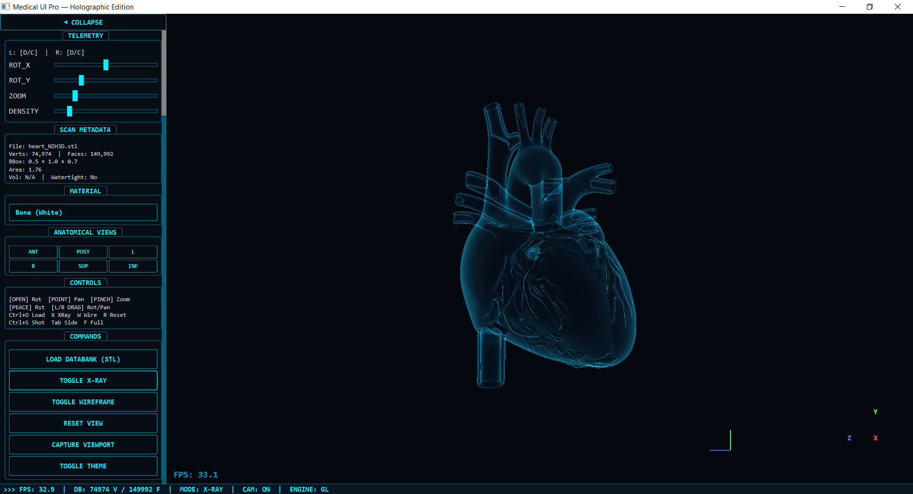

# 🏥 Medical UI Pro 




> ⚠️ **Medical Disclaimer:** This software is intended for **educational and research purposes only**.  
> It is **NOT** a certified medical device and must **NOT** be used for clinical diagnosis, treatment
> planning, or patient care without appropriate regulatory clearance (e.g., FDA 510(k), CE Mark).

A gesture-controlled **3D Medical STL Viewer** with hardware-accelerated OpenGL rendering and webcam
hand tracking. Built for biomedical engineering — inspect CT/MRI scan exports with hands-free gesture
control or conventional mouse/keyboard input.

**Stack:** Python · PyQt6 · OpenGL · MediaPipe · OpenCV · NumPy · trimesh

---

## ✨ Features

### Rendering Engine
- **GPU-Accelerated OpenGL** — Phong shading with 3-point lighting, handles 500K+ faces at 60 FPS
- **Software Renderer Fallback** — CPU-based Phong rendering for systems without GPU support
- **Volumetric X-Ray Mode** — Clinical additive alpha visualization with edge contours (Canny)
- **Wireframe Mode** — Depth-graded wireframe overlay
- **Orientation Gizmo** — XYZ axis indicator with color-coded labels (R/G/B = X/Y/Z)
- **Multi-Light Shading** — Key + fill + back light setup for clinical surface detail
- **Rim Lighting** — Fresnel-style edge glow for depth perception

### UI & Controls
- **Gesture Control** — Rotate, zoom, pan, and reset using hand gestures (webcam)
- **Mouse & Keyboard Fallback** — Full mouse + keyboard shortcuts when no webcam is available
- **Collapsible Sidebar** — Toggle with Tab to maximize viewport
- **Color/Material Picker** — 7 clinical presets (bone, tissue, organ, vessel, cartilage, metal, nerve)
- **Anatomical View Presets** — One-click Anterior/Posterior/Lateral/Superior/Inferior
- **Scan Metadata Panel** — Vertex count, face count, bounding box, surface area, volume, watertight
- **Screenshot Export** — Save viewport to PNG (Ctrl+S)
- **Loading Progress Bar** — Animated spinner with progress indicator
- **Dark/Light Theme Toggle** — Dark radiology mode and bright OR room mode
- **Auto Mesh Decimation** — Large meshes (> 50,000 faces) automatically simplified via quadric decimation
- **FPS Counter** — Persistent real-time frame counter in the 3D viewport
- **Two-Way Binding Sliders** — State-synchronized UI sliders (rotation/zoom/pan)
- **Interactive Status Bar** — Real-time telemetry, mode indicators, and engine status

---

## ⚙️ Prerequisites

| Requirement | Details |
|---|---|
| **OS** | Windows 10/11, macOS 12+, Ubuntu 20.04+ |
| **Python** | 3.9 – 3.12 (`mediapipe` is not yet compatible with Python 3.13+) |
| **GPU** | OpenGL 3.3+ recommended — software renderer fallback is available |
| **Webcam** | Optional — mouse/keyboard fallback activates automatically |
| **RAM** | ≥ 4 GB recommended; ≥ 8 GB for files > 100 MB |
| **Disk** | ~250 MB for dependencies; sample STL files included |

---

## 📸 Controls

### Gesture Controls (Webcam)

| Gesture | Action |
|---|---|
| ✋ Open palm | **Rotate** the model |
| ☝ Point (index only) | **Pan** / translate |
| 🤏 Pinch (thumb + index close) | **Zoom** in/out |
| ✌ Peace (index + middle) | **Reset** view to default |
| ✋✋ Two open palms | **Pan** using both hands (two-hand mode) |
| ✊ Fist | No action (gesture reserved) |

> **Note:** Gestures classified as `other` (ambiguous finger positions) also have no effect,
> preventing accidental view changes.

### Mouse Controls

| Input | Action |
|---|---|
| Left-drag | Rotate |
| Right-drag | Pan |
| Scroll | Zoom |

### Keyboard Shortcuts

| Key | Action |
|---|---|
| `Ctrl+O` | Load STL file |
| `Ctrl+S` | Save screenshot |
| `X` | Toggle X-Ray mode |
| `W` | Toggle wireframe |
| `R` | Reset view |
| `F` | Toggle fullscreen |
| `Tab` | Collapse/expand sidebar |

---

## 🚀 Setup & Run

### 1. Clone and set up environment

```bash
git clone https://github.com/kusumowidi/Medical-UI-Pro.git
cd Medical-UI-Pro

python -m venv .venv
# Windows:
.venv\Scripts\activate
# Linux / macOS:
source .venv/bin/activate
```

### 2. Install dependencies

For a reproducible install (recommended):
```bash
pip install -r requirements-lock.txt
```

For a fresh install with ranges:
```bash
pip install -r requirements.txt
```

### 3. Run

```bash
python main.py
```

> **Note:** The app auto-detects OpenGL support. If PyOpenGL fails to initialize, it falls back to
> the software renderer automatically.

---

## 🧪 Running Tests

```bash
pip install pytest pytest-cov
python -m pytest tests/ -v
```

Tests are headless — no GPU, display, or webcam required.

---

## 🏗️ Project Structure

```
3D_Control/
├── main.py              # Application entry, PyQt6 UI, gesture engine
├── gl_renderer.py       # Hardware-accelerated OpenGL viewport (primary)
├── renderer.py          # CPU software renderer (fallback)
├── models.py            # STL loader with validation, decimation, metadata
├── style.qss            # Dark radiology theme stylesheet
├── style_light.qss      # Light OR-room theme stylesheet
├── requirements.txt     # Python dependency ranges
├── requirements-lock.txt# Pinned reproducible lockfile
├── pyproject.toml       # Modern packaging metadata + tool config
├── CHANGELOG.md         # Version history
├── CONTRIBUTING.md      # Contributor guide
├── example.png          # UI preview image
├── LICENSE              # MIT license
├── .gitignore           # Git ignore rules
├── .github/
│   └── workflows/
│       └── lint.yml     # CI: ruff + mypy + pytest
└── tests/
    ├── __init__.py
    ├── test_models.py   # STL loading and mesh processing tests
    ├── test_renderer.py # Software renderer unit tests
    └── test_gestures.py # Gesture classification unit tests
```

> **STL sample files** (`*.stl`) are included in the root directory for immediate testing.

---

## 🔬 Architecture

```
Webcam (background daemon thread)
    │
    ├──▶ OpenCV frame capture (1280×720)
    │         │
    │         ▼
    │    MediaPipe Hands   →  21 landmarks per hand
    │         │
    │         ▼
    │    GestureClassifier  (classify_gesture)
    │    open / pinch / point / peace / fist / other
    │         │
    └─────────┼──▶ Thread-safe Queue (maxsize=2, drop-oldest)
              │
              ▼
    GUI Thread — QTimer (30 ms)  [AppViewer._tick()]
    ├── _process_gestures()   →  mutates target_view state dict
    ├── Exponential lerp      →  smooths current_view ← target_view
    ├── _sync_sliders()       →  two-way slider ↔ view state binding
    │
    ├── [OpenGL Path]                       [Software Path]
    │   GLViewport.paintGL()               SoftwareRenderer.render()
    │   ├── GLSL 330 vertex shader         ├── NumPy matrix transform
    │   ├── GLSL 330 fragment shader       ├── Perspective projection
    │   ├── 3-point Phong + rim light      ├── Multi-light Phong + rim
    │   ├── X-ray: additive alpha blend    ├── X-ray: additive + Canny
    │   ├── Wireframe: polygon mode        ├── Wireframe: cv2.polylines
    │   ├── Orientation gizmo (VAO)        ├── Gizmo: cv2.arrowedLine
    │   └── Loading spinner (VAO)          └── Painter's algorithm sort
    │
    └── PyQt6 Display  (QOpenGLWidget / QLabel)
```

### Data Flow: Mesh Dict Contract

All mesh data is passed between modules as a plain Python dict:

```python
{
    "verts":          np.ndarray,   # shape (N, 3), float32 — centered, normalized
    "faces":          np.ndarray,   # shape (M, 3), int32  — triangle indices
    "normals":        np.ndarray,   # shape (M, 3), float32 — face unit normals
    "vertex_normals": np.ndarray,   # shape (N, 3), float32 — smooth per-vertex normals
    "color":          tuple,        # (r, g, b) floats in [0.0, 1.0]
    "style":          str,          # "solid" | "wireframe" | "mixed" | "pointcloud"
    "metadata":       dict,         # see models.py for full schema
}
```

---

## 📋 Requirements

- **Python** 3.9 – 3.12
- **GPU** with OpenGL 3.3+ support (optional — software fallback available)
- **Webcam** (optional — mouse fallback available)
- **RAM** ~4 GB recommended for large STL files

### Dependencies

| Package | Version | Purpose |
|---|---|---|
| `opencv-python` | ≥4.8, <5.0 | Camera capture, image processing |
| `mediapipe` | ≥0.10, <0.12 | Real-time hand tracking |
| `numpy` | ≥1.24, <2.0 | Numerical computation |
| `PyQt6` | ≥6.5, <7.0 | Desktop UI framework |
| `trimesh` | ≥3.20, <5.0 | STL file loading and mesh processing |
| `PyOpenGL` | ≥3.1.7, <4.0 | Hardware-accelerated 3D rendering |

---

## 📄 License

MIT License — see [LICENSE](LICENSE) for details.

## 🤝 Contributing

See [CONTRIBUTING.md](CONTRIBUTING.md) for setup instructions, coding conventions, and PR process.

## 📝 Changelog

See [CHANGELOG.md](CHANGELOG.md) for version history.
